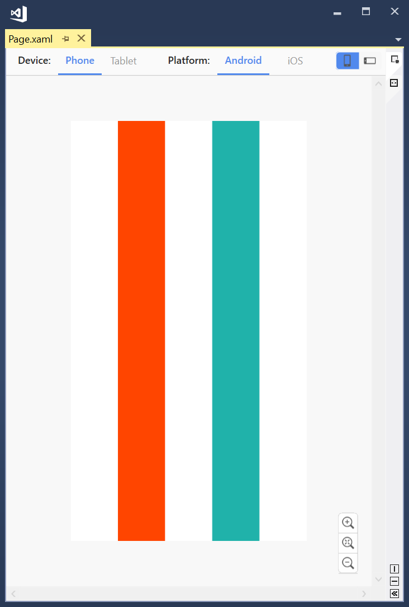

# Xamarin Forms AbsoluteLayout
AbsoluteLayout implemented the way you expected. Works exactly same as native AbsoluteLayout except that (0.25, 0.25, 0.5, 0.5) means what it should mean - a square box in the screen center half the screen in size.

## Setup
* Available on NuGet: https://www.nuget.org/packages/SmartMachines.AbsoluteLayout [](https://www.nuget.org/packages/SmartMachines.AbsoluteLayout)
* Add nuget package to your Xamarin.Forms netStandard project.
* Don't forget to add the xmlns namespace:
```xml
xmlns:sm="clr-namespace:SmartMachines;assembly=AbsoluteLayout"
```

* Now this:

```xml
<sm:AbsoluteLayout HorizontalOptions="FillAndExpand" VerticalOptions="FillAndExpand">
    <sm:AbsoluteLayout
        AbsoluteLayout.LayoutBounds="0,0,1,1"
        AbsoluteLayout.LayoutFlags="All"
        HorizontalOptions="FillAndExpand"
        VerticalOptions="FillAndExpand">
        <BoxView
            AbsoluteLayout.LayoutBounds="0,0,.2,1"
            AbsoluteLayout.LayoutFlags="All"
            Color="OrangeRed" />

        <BoxView
            AbsoluteLayout.LayoutBounds=".6,0,.2,1"
            AbsoluteLayout.LayoutFlags="All"
            Color="LightSeaGreen" />
    </sm:AbsoluteLayout>

</sm:AbsoluteLayout>
```

Will translate into this:
<html>
<p align="center">
  
</p>
</html>

Enjoy!

## License
The MIT License (MIT) see [License file](LICENSE)

## Contribution
Feel free to create issues and PRs :)
